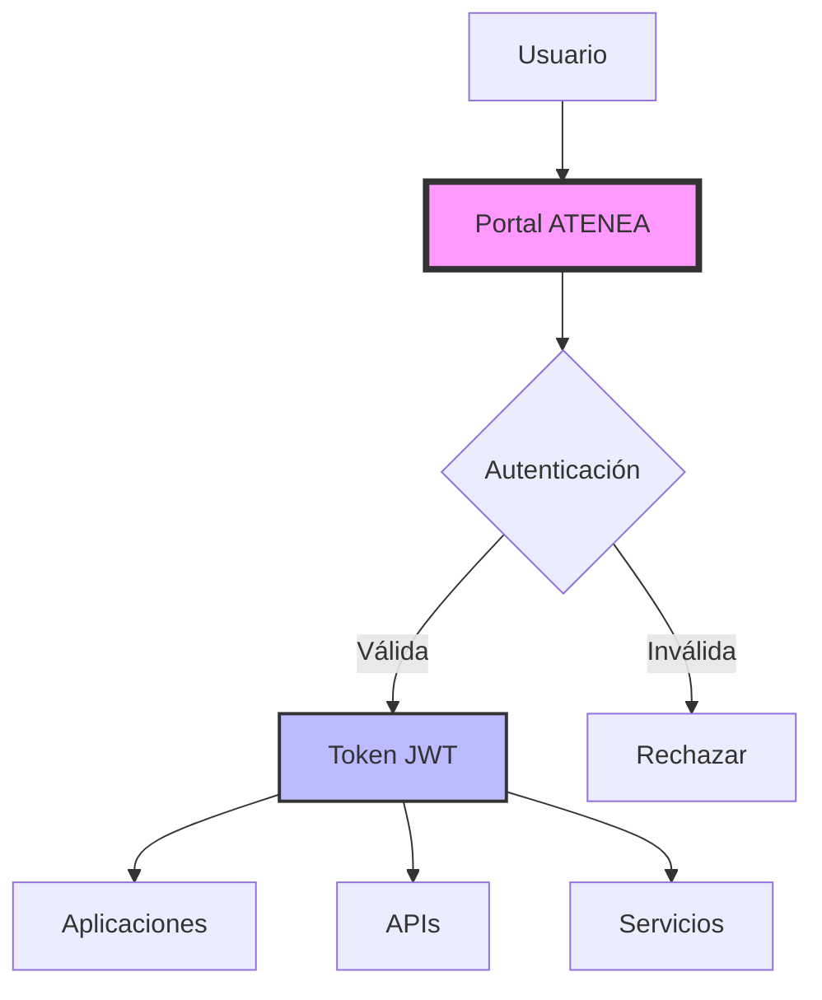

# 🛡️ ATENEA - Plataforma de Seguridad e Identidad

## Documento alojado en GitHub

## Descripción General

**ATENEA** es la plataforma corporativa de gestión de identidades y accesos (IAM) que proporciona un marco unificado de seguridad para todas las aplicaciones y servicios de la organización.

Esta documentación debe considerarse una muestra no funcional ni relevante. Contenido generado por IA.

---

## 🎯 Características Principales

<div class="grid cards" markdown>

-   :material-account-key:{ .lg .middle } **Single Sign-On (SSO)**

    ---

    Acceso unificado a todas las aplicaciones con una única autenticación

-   :material-shield-lock:{ .lg .middle } **Multi-Factor Authentication**

    ---

    Seguridad reforzada con múltiples factores de autenticación

-   :material-account-group:{ .lg .middle } **Gestión de Roles**

    ---

    Control granular de permisos basado en roles y políticas

-   :material-chart-line:{ .lg .middle } **Auditoría y Compliance**

    ---

    Trazabilidad completa y cumplimiento normativo

</div>

## 🚀 Quick Start

### Requisitos Previos

- Credenciales corporativas activas
- VPN conectada (para acceso remoto)
- Navegador web actualizado

### Acceso a la Plataforma

1. **Acceder al portal**: `https://atenea.empresa.com`
2. **Introducir credenciales corporativas**
3. **Completar autenticación MFA**
4. **Seleccionar aplicación destino**

## 📊 Arquitectura



## 🔧 Configuración

### Integración con Aplicaciones

```yaml
# config-atenea.yml
atenea:
  client_id: "APP-CLIENT-001"
  client_secret: "${ATENEA_SECRET}"
  auth_endpoint: "https://atenea.empresa.com/oauth/authorize"
  token_endpoint: "https://atenea.empresa.com/oauth/token"
  redirect_uri: "https://miapp.empresa.com/callback"
  scopes:
    - profile
    - email
    - roles
```

### Ejemplo de Implementación

```javascript
// Ejemplo de integración con Node.js
const AteneaAuth = require('@empresa/atenea-sdk');

const atenea = new AteneaAuth({
    clientId: process.env.ATENEA_CLIENT_ID,
    clientSecret: process.env.ATENEA_CLIENT_SECRET,
    redirectUri: process.env.REDIRECT_URI
});

// Middleware de autenticación
app.use(atenea.authenticate());

// Proteger rutas
app.get('/api/secure', atenea.requireAuth(), (req, res) => {
    res.json({ 
        user: req.user,
        roles: req.user.roles 
    });
});
```

## 📋 Gestión de Usuarios

### Roles Disponibles

| Rol | Descripción | Permisos |
|-----|-------------|----------|
| **ADMIN** | Administrador del sistema | Acceso total |
| **DEVELOPER** | Desarrollador | Acceso a entornos de desarrollo |
| **ANALYST** | Analista de negocio | Acceso de lectura y reportes |
| **USER** | Usuario estándar | Acceso básico a aplicaciones |

## 🔐 Políticas de Seguridad

!!! warning "Importante"
    - Las contraseñas deben tener mínimo 12 caracteres
    - MFA es obligatorio para roles administrativos
    - Las sesiones expiran después de 8 horas de inactividad

### Rotación de Credenciales

- **Contraseñas**: Cada 90 días
- **Tokens API**: Cada 180 días
- **Certificados**: Anualmente

## 📚 APIs Disponibles

### Authentication API

```bash
# Obtener token
curl -X POST https://atenea.empresa.com/api/v1/auth/token \
  -H "Content-Type: application/json" \
  -d '{
    "username": "usuario@empresa.com",
    "password": "********",
    "grant_type": "password"
  }'
```

### User Management API

```bash
# Obtener información del usuario
curl -X GET https://atenea.empresa.com/api/v1/users/me \
  -H "Authorization: Bearer ${TOKEN}"
```

## 🛠️ Herramientas y Utilidades

- **ATENEA CLI**: Herramienta de línea de comandos para gestión
- **ATENEA SDK**: Librerías para Java, .NET, Node.js y Python
- **ATENEA Dashboard**: Panel de control web para administradores

## 📈 Monitorización

### Métricas Clave

- Intentos de login exitosos/fallidos
- Tiempo medio de respuesta
- Usuarios activos concurrentes
- Tokens activos

### Dashboard de Estado

Acceso al dashboard: [https://atenea.empresa.com/status](https://atenea.empresa.com/status)

## 🆘 Soporte y Troubleshooting

### Problemas Comunes

??? question "No puedo acceder a mi cuenta"
    1. Verifica que tu cuenta esté activa en Active Directory
    2. Comprueba que no haya expirado tu contraseña
    3. Intenta restablecer tu contraseña desde el portal de autoservicio

??? question "Error de MFA"
    1. Sincroniza la hora de tu dispositivo
    2. Genera un nuevo código QR desde el portal
    3. Contacta con soporte si el problema persiste

### Contacto

- **Email**: soporte-atenea@empresa.com
- **Slack**: #atenea-support
- **Teléfono**: +34 900 123 456

## 📖 Referencias

- [Documentación Oficial de OAuth 2.0](https://oauth.net/2/)
- [Guía de Mejores Prácticas de Seguridad](./security-best-practices.md)
- [API Reference Completa](./api-reference.md)
- [Changelog y Versiones](./changelog.md)

---

!!! info "Última actualización"

    Esta documentación fue actualizada el 15 de enero de 2024. Versión de ATENEA: v3.2.1

